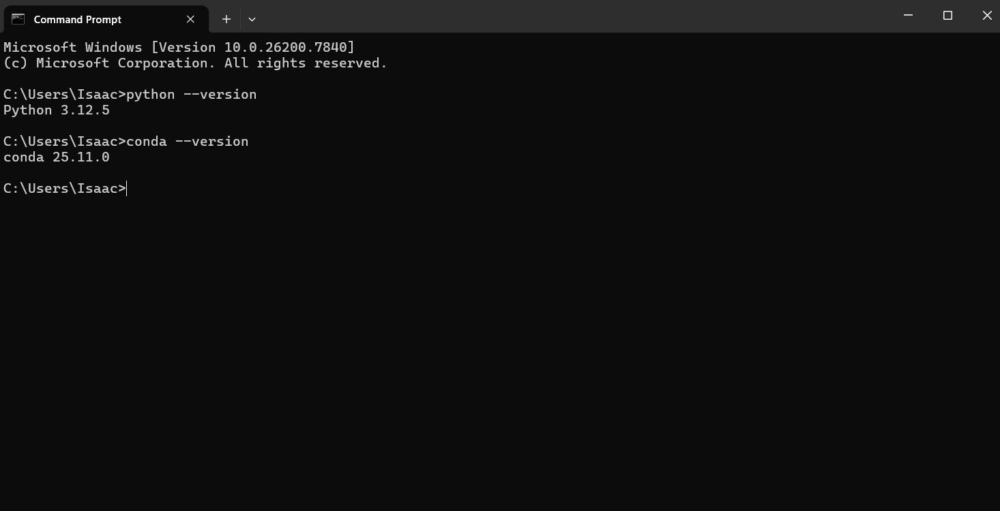
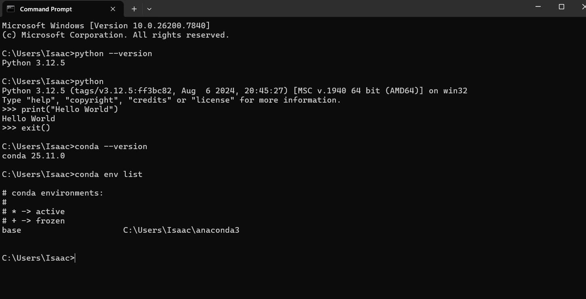
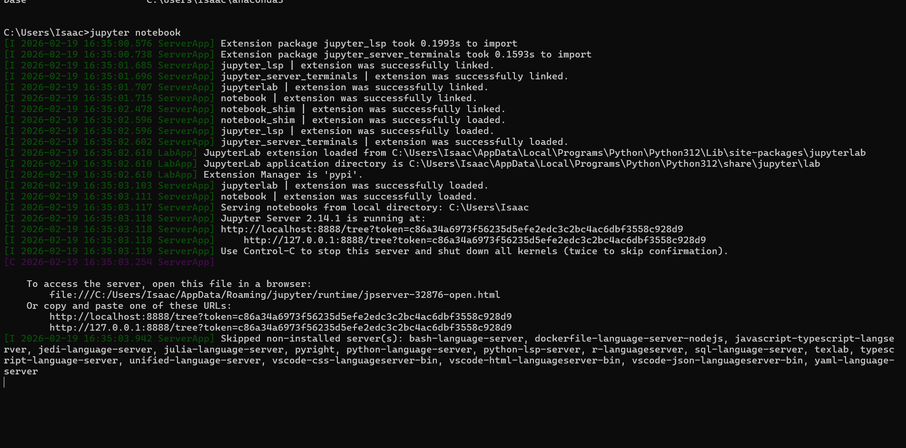

# Network-Traffic-Anomaly-Detection-system
# README Documentation: Data Science Lifecycle (Question → Data → Insight)

## 1. Lifecycle

The **Question → Data → Insight** lifecycle is the backbone of data science. It emphasizes that meaningful analysis starts with reasoning, not just tools or numbers. Here’s how it works:

**What does it meant to Start with a Clear Question?**

* A clear question defines the purpose of the analysis. It ensures the team focuses on solving a real problem rather than just exploring data randomly.
* Example: Instead of asking, “What can we learn from our sales data?”, a sharper question is, “Which products are likely to have declining sales next quarter, and why?”
* This step is critical because without a clear question, data exploration can become aimless, leading to wasted effort and misleading conclusions.

**How does Data act as Evidence and what does it mean to understand data before analyzing it?**

* Data is the raw evidence we use to answer our question. Understanding its structure, quality, and limitations is essential before any analysis.
* Example: Knowing that sales data comes from point-of-sale systems, includes returns, or has missing timestamps is crucial. Misinterpreting data can lead to incorrect insights.
* This step prevents “garbage in, garbage out” outcomes, ensuring analysis is grounded in reality.

**How do Insights Emerge from Exploration?**

* Insights are patterns, trends, or relationships in the data that answer the original question. They do not emerge just from running models or creating charts—they emerge from thoughtful examination of the data in the context of the question.
* Example: Noticing that certain products sell better in specific regions might reveal a marketing opportunity, but this only becomes an insight when linked back to the business question.

**Connecting the Steps**

* The lifecycle flows naturally: a clear question determines what data is needed, understanding the data allows for careful exploration, and exploration produces actionable insights. Skipping steps can lead to irrelevant or misleading results.

---

## Applying the Lifecycle: Network Traffic Anomaly Detection (ML-based IDS)

**Project Context:**

* **Domain:** Cybersecurity
* **Core Idea:** Detect suspicious network behavior using traffic volume, protocol usage, and timing patterns.

---

### 1. Question

A clear question focuses the analysis and guides what data is relevant:

**Example Questions:**

* “Which network activities are unusual or potentially malicious?”
* “Can we identify anomalies in traffic patterns that indicate an intrusion before damage occurs?”

**Why it matters:**

* In cybersecurity, detecting threats proactively is critical. Without a clear question, the analysis could produce irrelevant alerts or miss critical anomalies.
* ML models without a defined objective may flag harmless patterns as threats or overlook true attacks.

---

### 2. Data

Data acts as evidence to answer the question. For an ML-based IDS, the types of data needed include:

**Types of Data:**

* **Traffic Volume:** Packets per second, bytes per connection, session duration.
* **Protocol Usage:** Frequency of TCP, UDP, ICMP, HTTP, or unusual port activity.
* **Timing Patterns:** Connection intervals, bursts, periodic spikes.
* **Network Metadata:** Source/destination IPs, geolocation, device types.
* **Labels (optional):** Known benign vs. malicious traffic from historical logs.

**Where it comes from:**

* Network routers and switches (NetFlow, packet capture logs).
* Firewalls and security appliances.
* Public cybersecurity datasets (e.g., CICIDS, KDD99) for benchmarking.

**Why understanding data first is critical:**

* Traffic data is often messy, with missing timestamps, noise, or benign anomalies.
* Understanding distributions, typical patterns, and anomalies prevents false positives and ensures the ML model focuses on real threats.

---

### 3. Insight

**Possible Insights:**

* Certain IPs or subnets generate traffic patterns that deviate significantly from normal behavior.
* Specific protocol combinations or timing spikes correlate with intrusion attempts.
* Seasonal or time-of-day trends in traffic can help distinguish normal high-volume spikes from attacks.

**Decision-Making Use:**

* Prioritize alerts for suspicious activity in real-time.
* Inform firewall rules or automated response systems.
* Improve ML model training by highlighting features that are most predictive of anomalies.

**Key Point:**

* Insights emerge from exploration—statistical summaries, clustering, anomaly scoring—not just from raw traffic data or ML algorithms applied blindly.


---

## Development Environment Setup

**Operating System:** Windows 11 
**Python Version:** Python 3.12.5  
**Anaconda Version:** conda 25.11.0  

### Setup Steps
1. Installed Python via Anaconda distribution
2. Verified Python installation using `python --version`
3. Verified Conda installation using `conda --version`
4. Activated Conda base environment
5. Launched Python from terminal to confirm setup

### Verification Commands
```bash
python --version
conda --version
```
---
```
### Verification Proof


## Environment Verification

**Operating System:** Windows 11  
**Python Version:** Python 3.12.5  
**Conda Version:** conda 25.11.0  
**Environment Used:** base

### Verification Steps
1. Verified Python using `python --version` and Python REPL
2. Verified Conda using `conda --version`, listed environments, and activated base
3. Verified Jupyter by launching notebook and running a simple Python cell

### Proof
```bash
python --version
Python 3.12.5

conda --version
conda 25.11.0

# Jupyter notebook launched successfully and Python cell executed
```



